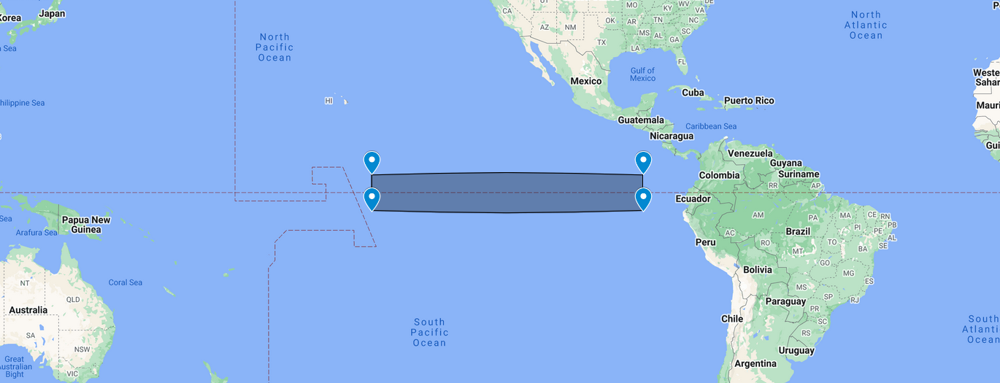

# Seasonal Forecast Verification

This repository contains analysis for verifying and assessing seasonal forecast accuracy and skill. It is designed for researchers and practitioners working with forecasting, enabling evaluation and visualization of probabilistic forecast performance. In this example, climate data was used but it can be apply to any other environmental variable (hydrology, ecology, etc.)

## Why is this important?
- **Purpose**: to evaluate how well the forecast matches observed outcomes. It quantifies the reliability of the predictions, helping users understand their accuracy and limitations.
- **Building confidence**: verification provides confidence to stakeholders (e.g., water managers, farmers, policymakers) in using the forecast as a decision-making tool. A forecast with demonstrated skill is more likely to be trusted and applied.
- **Determining practical value**: seasonal forecasts often have limited skill, especially in certain regions or for specific variables. Verification helps determine the operational value of applying the forecast.
- **Communicating uncertainty**: seasonal forecasts are probabilistic and inherently uncertain. Verification ensures that this uncertainty is quantified and effectively communicated.

## Features

- **Skill Metrics**: Evaluate forecasts using common metrics like:
  - Correlation (e.g., Pearson, Spearman)
  - Continuous Ranked Probability Skill Score (CRPSS), [full explanation here](https://www.lokad.com/continuous-ranked-probability-score)
- **Visualization**: 
  - Time series comparisons
  - Scatter plots
  - Heatmap of skill 
- **Flexible Analysis**: Customizable for various datasets, regions, variables, and temporal scales.
- **Support for Observations**: Integrate observational or reanalysis data for benchmarking.

## Explanation
- **data**: contains the original NetCDF data used in the analysis
- **download**: contains the python scripts to download the data from Copernicus CDS API service
- **verification.ipynb**: if you follow this code, you should be able to implement a seasonal forecast verification

## Case Study
- **Target variable**: here only air temperature is used in the analysis, but the workflow is reproducible to any meteorological or environmental variable
- **Data source**: ERA5 reanlysis was used as observation and SEAS5 as seasonal forecast
- **Area of study**: area of the index for Niño 3 (4°N to 4°S, 150°W to 90°W), also called Japanese Meteorological Agency ENSO Index (JMA). [View on Maps](https://www.google.com/maps/d/embed?mid=1kvhJP6_DFn7CQyJM9fstEXsvv4uUBCg&hl=en)


## Installation

Clone the repository to your local machine:

```bash
git clone https://github.com/danielmerbet/seasonal_forecast_verification.git
cd seasonal_forecast_verification
